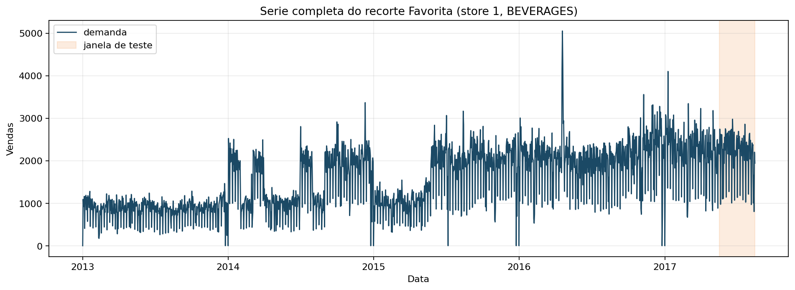
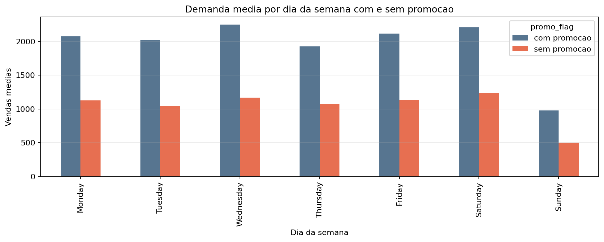

# Previsão de demanda e otimização de estoque: por que este problema importa

## Resumo

Este primeiro artigo abre a série com o problema de negócio que vai sustentar todos os experimentos seguintes: previsão de demanda para reposição de estoque. O objetivo é mostrar por que esse problema é valioso, por que ele é difícil e por que ele cria um caminho didático natural até Reservoir Computing (RC) e Quantum Reservoir Computing (QRC). Em vez de começar pela teoria do reservatório, começamos pelo custo do erro no varejo, formalizamos a tarefa de previsão, fixamos o recorte experimental no dataset Favorita e mostramos as primeiras estatísticas reais da série `store_nbr = 1` e `family = BEVERAGES`. Ao final, o leitor sabe como carregar o recorte, entende as métricas que vão guiar a série, enxerga o impacto de promoção e calendário e tem um mapa completo dos sete artigos.

## 1. O que o leitor vai aprender

Ao final deste artigo, você será capaz de:

1. explicar por que previsão de demanda e um problema central de negócio;
2. formular matematicamente a tarefa de previsão da série;
3. reproduzir o recorte adotado no Favorita em toda a obra;
4. interpretar os primeiros artefatos computacionais antes de treinar qualquer modelo;
5. entender por que esse problema é uma boa rota pedagógica até QRC.

## 2. O problema de negócio antes do modelo

Previsão de demanda é importante porque o erro entra diretamente na decisão de estoque. Se a empresa compra menos do que deveria, perde venda. Se compra mais, imobiliza capital e aumenta o risco de desperdício. Em um ambiente de varejo alimentar, isso acontece em escala diária, com milhares de decisões pequenas produzindo efeitos acumulados grandes.

Um modo simples de formalizar esse efeito é escrever o erro de previsão como

$$
e_{t+h} = y_{t+h} - \hat{y}_{t+h},
$$

em que $y_{t+h}$ é a demanda observada e $\hat{y}_{t+h}$ é a previsão produzida no tempo $t$ para o horizonte $h$.

Esse erro alimenta uma política operacional mínima de reposição:

$$
R_t = \hat{y}_{t+1} + SS_t,
$$

em que $R_t$ é a quantidade planejada para reposição e $SS_t$ é um estoque de segurança. Mesmo sem modelar toda a política de inventário, a equação deixa claro o ponto principal: melhorar $\hat{y}_{t+1}$ melhora a qualidade da decisão.

## 3. Da pergunta de negócio para a tarefa de previsão

Ao longo da série, vamos modelar a tarefa como

$$
\hat{y}_{t+h} = f(y_{1:t}, x_{1:t+h}),
$$

em que:

- $y_{1:t}$ representa o histórico de vendas observado até o tempo $t$;
- $x_{1:t+h}$ representa sinais exógenos, como promoção e calendário;
- $f(\cdot)$ será implementada por modelos estatísticos, de IA clássica, RC e QRC.

Essa forma é importante pedagogicamente porque nos permite manter o mesmo problema enquanto trocamos a família de modelo. O que muda do artigo 1 ao 7 não é a pergunta. O que muda e a maneira de construir a representação temporal.

## 4. O dataset Favorita e o recorte didático da série

O projeto usa o dataset da competição *Corporacion Favorita Grocery Sales Forecasting* como fio condutor. Para manter o ensino progressivo e reproduzível, toda a série começa no mesmo recorte:

- loja: `store_nbr = 1`
- família: `BEVERAGES`
- frequência: diária
- teste: últimos `90` dias

A tabela abaixo resume o recorte real usado nas implementações.

| Métrica | Valor |
| --- | --- |
| Dias totais no recorte | 1688 |
| Dias de treino | 1598 |
| Dias de teste | 90 |
| Média diária de vendas | 1583.99 |
| Desvio padrão das vendas | 729.89 |
| Taxa média de promoção | 60.37% |
| Taxa de dias com venda zero | 0.59% |
| Inicio do treino | 2013-01-01 |
| Inicio do teste | 2017-05-18 |
| Fim do teste | 2017-08-15 |

O carregamento desse recorte e implementado em `code/common/favorita.py`. O núcleo da reprodução e o seguinte:

```python
from common.favorita import (
    FavoritaSeriesConfig,
    load_store_family_series,
    temporal_train_test_split,
)

config = FavoritaSeriesConfig(store_nbr=1, family="BEVERAGES", test_days=90)
frame = load_store_family_series(store_nbr=config.store_nbr, family=config.family)
train, test = temporal_train_test_split(frame, test_days=config.test_days)
```

Esse código faz três coisas que sao centrais para toda a série:

1. fixa um recorte comum para todos os modelos;
2. densifica o calendário diário, preenchendo dias faltantes com zero;
3. garante um split temporal idêntico para comparações posteriores.

## 5. O que os dados já ensinam antes de qualquer modelo

Antes de falar de RC ou QRC, vale observar o comportamento bruto da série.



A visão geral mostra que o problema não é trivial por pelo menos três motivos:

- há variação forte ao longo do tempo;
- a série responde a padrões semanais;
- promoção altera o patamar das vendas.

O perfil semanal médio confirma esse último ponto.

| Dia da semana | Média com promoção | Média sem promoção |
| --- | --- | --- |
| Monday | 2074.45 | 1125.28 |
| Tuesday | 2016.35 | 1046.04 |
| Wednesday | 2248.32 | 1166.31 |
| Thursday | 1927.36 | 1074.45 |
| Friday | 2116.13 | 1133.84 |
| Saturday | 2209.90 | 1232.53 |
| Sunday | 977.32 | 498.80 |



Duas leituras didáticas aparecem imediatamente:

1. a série tem sazonalidade semanal clara, o que justifica baselines como `Seasonal Naive` e `ETS`;
2. promoção desloca a média de vendas em todos os dias da semana, o que torna natural incluir variáveis exógenas.

Esse é o primeiro motivo para escolher esse problema como rota até QRC: mesmo o recorte inicial já exige memória temporal e sensibilidade a contexto.

## 6. Passo-a-passo para reproduzir o recorte

O leitor pode reproduzir o ponto de partida da obra em quatro passos.

### 6.1 Passo 1: localizar os dados

Os arquivos brutos foram organizados em `dataset/raw/`, com `train.csv`, `transactions.csv`, `stores.csv`, `holidays_events.csv`, `oil.csv` e `test.csv`.

### 6.2 Passo 2: carregar uma única série

A função `load_store_family_series()` filtra por loja e família, ordena por data e produz um `DataFrame` com as colunas:

- `ds`: data
- `y`: demanda diária
- `onpromotion`: sinal exógeno básico usado nos modelos

### 6.3 Passo 3: fixar o split temporal

A função `temporal_train_test_split()` implementa a regra que vamos herdar em toda a série:

- o passado vai para treino;
- os últimos `90` dias vão para teste;
- nenhuma observação do futuro entra no treino.

### 6.4 Passo 4: inspecionar o recorte

Os artefatos computacionais deste artigo já mostram o mínimo necessario para não modelar no escuro:

- `series_overview.png`
- `weekly_profile.png`
- `recorte_summary.csv`

Em um projeto real, essa etapa não é opcional. Ela evita treinar modelos sofisticados sobre uma série mal definida.

## 7. Como vamos medir desempenho

Toda a obra usa as mesmas quatro métricas, implementadas em `code/common/metrics.py`.

O erro absoluto médio e dado por

$$
\mathrm{MAE} = \frac{1}{n} \sum_{t=1}^n |y_t - \hat{y}_t|.
$$

O erro quadrático médio com raiz e dado por

$$
\mathrm{RMSE} = \sqrt{\frac{1}{n} \sum_{t=1}^n (y_t - \hat{y}_t)^2}.
$$

O erro absoluto ponderado pelo volume da série e dado por

$$
\mathrm{WAPE} = \frac{\sum_{t=1}^n |y_t - \hat{y}_t|}{\sum_{t=1}^n |y_t|}.
$$

E o erro percentual absoluto médio simetrico e dado por

$$
\mathrm{sMAPE} = \frac{1}{n} \sum_{t=1}^n
\frac{2 |y_t - \hat{y}_t|}{|y_t| + |\hat{y}_t|}.
$$

Essas métricas vão aparecer repetidamente porque cada uma responde a uma pergunta diferente:

- `MAE`: erro médio em unidades de venda;
- `RMSE`: sensibilidade a erros grandes;
- `WAPE`: erro relativo ao volume total;
- `sMAPE`: comparação percentual mais estável em séries com escalas diferentes.

## 8. Por que esse problema conduz naturalmente até RC e QRC

Há pelo menos quatro motivos.

1. A série depende do passado, entao memória importa.
2. O efeito de promoção e calendário não é constante, entao não linearidade importa.
3. O protocolo de negócio e simples de explicar, entao o leitor não se perde no dominio.
4. O mesmo recorte pode ser usado para modelos estatísticos, IA clássica, RC e QRC.

Em outras palavras, o problema e suficientemente real para ser relevante e suficientemente controlado para ser didático.

## 9. Roadmap dos sete artigos

O percurso da série será o seguinte:

1. artigo 1: problema de negócio, recorte e métricas;
2. artigo 2: fundamentos de Reservoir Computing;
3. artigo 3: primeiro pipeline reproduzível com baseline e RC;
4. artigo 4: memória, não linearidade e tuning do RC;
5. artigo 5: benchmark justo entre todas as implementações;
6. artigo 6: ponte de RC clássico para QRC;
7. artigo 7: estudo final de QRC no Favorita.

Essa organização evita um erro comum em textos de QRC: apresentar o formalismo quântico antes de o leitor entender a tarefa, o protocolo experimental e a lógica do reservatório.

## 10. Conclusão

O ponto de partida da série esta estabelecido. Temos um problema de negócio real, um recorte experimental fixo, um pipeline mínimo de carregamento de dados e um conjunto de métricas que permitira comparações honestas. Esse chao comum e o que torna possível ensinar RC e QRC sem perder o leitor em abstrações.

O próximo artigo parte daqui para responder a pergunta central que o leitor provavelmente já esta fazendo: afinal, o que é um reservatório e por que ele pode ser útil para uma série temporal como essa?

## Entregaveis associados no repositorio

- dados brutos: `dataset/raw/`
- carga do recorte: `code/common/favorita.py`
- métricas: `code/common/metrics.py`
- artefatos deste artigo: `computational_results_20260402_222902/`
- figuras principais: `series_overview.png` e `weekly_profile.png`

## Referencias

- Corporacion Favorita Grocery Sales Forecasting. Kaggle.
- Hyndman, R. J.; Athanasopoulos, G. Forecasting: Principles and Practice.
- Jaeger, H. The "echo state" approach to analysing and training recurrent neural networks.
- Lukosevicius, M.; Jaeger, H. Reservoir computing approaches to recurrent neural network training.
