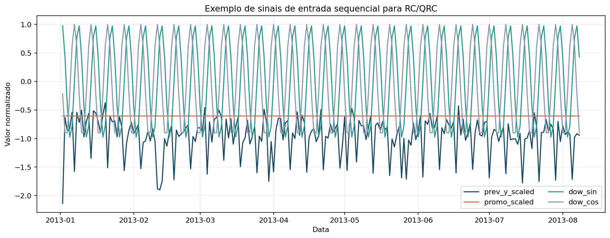
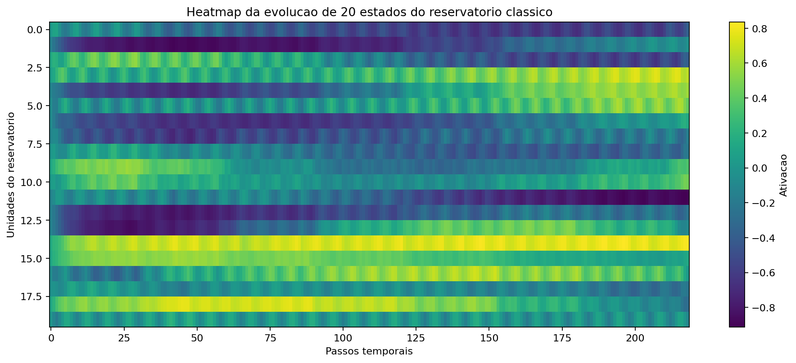

# Fundamentos de Reservoir Computing: da intuição ao modelo mínimo

## Resumo

Este artigo apresenta Reservoir Computing (RC) como o primeiro grande degrau teórico da série. O foco não é apenas definir o termo, mas mostrar como um reservatório transforma uma sequência em uma representação dinâmica heterogenea, não linear e com memória distribuída. Além da intuição e das equações, o texto introduz uma camada que faltava na versão anterior: como avaliar o que o RC realmente entrega em três níveis diferentes: qualidade da representação interna, qualidade da previsão final e qualidade da estabilidade experimental. No recorte Favorita, o RC clássico funciona, produz estados coerentes e previsões reprodutíveis, mas a configuração default ainda fica atrás de `Seasonal Naive` e `ETS`. Também mostramos que seed, `spectral_radius`, `leak_rate`, `washout` e `n_reservoir` mudam materialmente o erro, o que transforma esses hiperparâmetros em decisões de projeto, e não em detalhes cosméticos.

## 1. O que o leitor vai aprender

Ao final deste artigo, você será capaz de:

1. definir um reservatório clássico de forma matemática;
2. distinguir estado interno, vetor de entrada e readout;
3. explicar o papel de `spectral_radius`, `leak_rate` e `washout`;
4. mapear as equações de RC para a implementação em `code/rc/model.py`;
5. separar qualidade da representação interna, qualidade da previsão final e qualidade da estabilidade experimental.

## 2. A intuição: o que um reservatório faz, antes da equação

Em um modelo tabular tradicional, as features costumam ser calculadas explicitamente: lags, médias móveis, indicadores de calendário e assim por diante. Em RC, a ideia é diferente. Em vez de escrever manualmente toda a representação temporal, injetamos a sequência em um sistema dinamico recorrente e usamos seus estados internos como uma base de representação.

A melhor imagem mental para um iniciante é esta:

- a entrada $u_t$ entra no sistema no instante atual;
- o sistema ainda guarda parte do que aconteceu antes;
- essa mistura entre presente e passado gera um novo estado interno;
- a previsão final e feita a partir desse estado.

Em outras palavras, o reservatório não tenta prever diretamente. Primeiro ele **transforma a sequência em estados internos**. Só depois o readout aprende a ler esses estados.

Se quisermos resumir RC em uma frase curta, ela seria:

> o reservatório e um mecanismo fixo que converte sequências em representações dinâmicas; o readout e a parte treinada que converte essas representações em previsão.

Essa divisão é importante porque reduz a carga conceitual:

1. primeiro entendemos como o estado interno evolui;
2. depois entendemos como a previsão sai desse estado.

## 3. Construindo o modelo mínimo de RC

Em muitos textos de RC, a equação do reservatório aparece pronta, em uma única linha. Para quem esta vendo o tema pela primeira vez, isso costuma ser brusco demais. Aqui vamos fazer o caminho inverso: começamos com a pergunta intuitiva, descemos até um único passo de atualizacao, olhamos um exemplo de uma única unidade e só entao escrevemos a equação completa.

### 3.1 A pergunta central em um único passo

Em cada instante $t$, o reservatório recebe uma entrada $u_t$ e mantem internamente um estado $x_{t-1}$ vindo do passo anterior. O problema do passo atual pode ser formulado assim:

> dado o que entrou agora e dado o que o sistema ainda guarda do passado, como produzir o novo estado $x_t$?

Essa pergunta já organiza quase todo o raciocinio. O novo estado precisa depender de duas coisas:

- da entrada atual;
- da memória que o proprio sistema traz do passo anterior.

### 3.2 Os ingredientes da atualizacao

Para responder a essa pergunta, o modelo usa:

- $u_t \in \mathbb{R}^d$, o vetor de entrada no tempo $t$;
- $x_{t-1} \in \mathbb{R}^N$, o estado interno do passo anterior;
- $W_{in}$, a matriz que projeta a entrada para o espaco do reservatório;
- $W_{res}$, a matriz recorrente interna, que mistura os componentes do proprio estado;
- $b$, um vetor de bias;
- $\alpha \in (0,1]$, o `leak_rate`, que controlara quanto do estado novo realmente entra.

O ponto principal aqui não é decorar a notação. O ponto principal e perceber o papel de cada termo:

- $W_{in} u_t$ traz o **efeito da entrada atual**;
- $W_{res} x_{t-1}$ traz o **efeito do passado interno**;
- $b$ apenas desloca essa resposta;
- $\alpha$ vai decidir quanto do estado novo substitui o antigo.

### 3.3 Primeiro passo: montar a resposta bruta do sistema

Antes de falar em "estado candidato", vale pensar no que acontece imediatamente quando somamos os efeitos do presente e do passado. Chamaremos essa soma de pre-ativacao:

$$
z_t = W_{res} x_{t-1} + W_{in} u_t + b.
$$

Essa expressão pode ser lida em voz alta assim:

> resposta bruta no tempo $t$ = efeito da memória anterior + efeito da entrada atual + bias.

O vetor $z_t$ ainda não é o novo estado final. Ele e apenas a combinacao linear inicial das influencias que atuam sobre o reservatório naquele instante.

### 3.4 Segundo passo: aplicar a não linearidade

Se usassemos diretamente $z_t$ como novo estado, o modelo seria linear demais e perderia boa parte da riqueza que queremos em um reservatório. Por isso, aplicamos uma não linearidade componente a componente:

$$
\widetilde{x}_t = \tanh(z_t).
$$

Substituindo $z_t$, obtemos:

$$
\widetilde{x}_t = \tanh(W_{res} x_{t-1} + W_{in} u_t + b).
$$

O vetor $\widetilde{x}_t$ recebe o nome de **estado candidato**. Ele representa a resposta que o reservatório produziria se reagisse imediatamente ao passo atual.

A função $\tanh(\cdot)$ tem três papeis didaticamente importantes:

- introduz não linearidade;
- comprime os valores no intervalo $(-1,1)$;
- ajuda a manter a dinâmica interna em uma faixa controlada.

Uma maneira simples de sentir isso e olhar alguns valores:

- se $z = 0.2$, entao $\tanh(0.2) \approx 0.197$;
- se $z = 3$, entao $\tanh(3) \approx 0.995$;
- se $z = -4$, entao $\tanh(-4) \approx -0.999$.

Isso mostra que a não linearidade não apenas "entorta" a resposta: ela também evita que os valores crescam sem limite.

### 3.5 Um exemplo com uma única unidade

Para tornar a ideia menos abstrata, imagine por um momento um reservatório com apenas uma unidade. Nesse caso, todos os vetores e matrizes viram escalares:

$$
z_t = w_{res} x_{t-1} + w_{in} u_t + b.
$$

Suponha:

- $x_{t-1} = 0.40$;
- $u_t = 0.70$;
- $w_{res} = 0.50$;
- $w_{in} = 1.20$;
- $b = -0.10$.

Entao:

$$
z_t = 0.50 \cdot 0.40 + 1.20 \cdot 0.70 - 0.10 = 0.94.
$$

Aplicando a não linearidade:

$$
\widetilde{x}_t = \tanh(0.94) \approx 0.735.
$$

Essa conta simples ajuda a visualizar o processo:

1. o passado contribui com uma parte;
2. a entrada atual contribui com outra parte;
3. tudo isso passa pela `tanh`;
4. o resultado se torna o estado candidato.

### 3.6 Terceiro passo: misturar memória e atualizacao nova

O reservatório ainda não adota $\widetilde{x}_t$ como estado final. Em vez disso, ele mistura parte da memória anterior com parte do estado candidato:

$$
x_t = (1 - \alpha) x_{t-1} + \alpha \widetilde{x}_t.
$$

Essa é a parte que transforma o reservatório em um sistema com memória controlada. O parametro $\alpha$ regula a velocidade da atualizacao:

- se $\alpha$ e pequeno, o sistema preserva mais memória e muda devagar;
- se $\alpha$ e grande, o sistema reage mais ao presente e muda mais rápido.

Voltando ao exemplo anterior, se $x_{t-1} = 0.40$, $\widetilde{x}_t \approx 0.735$ e $\alpha = 0.20$, entao:

$$
x_t = 0.80 \cdot 0.40 + 0.20 \cdot 0.735 \approx 0.467.
$$

O leitor deve notar o seguinte: o estado final $x_t$ ainda carrega parte do passado. Ele não salta diretamente para o estado candidato.

### 3.7 A equação completa do reservatório

Agora sim podemos juntar os passos anteriores. Substituindo o estado candidato na equação de mistura, chegamos a dinâmica completa:

$$
x_t = (1 - \alpha) x_{t-1} + \alpha \tanh(W_{res} x_{t-1} + W_{in} u_t + b).
$$

A leitura guiada dessa expressão e:

- olhe para o passado: $x_{t-1}$;
- combine esse passado com a entrada atual: $W_{res} x_{t-1} + W_{in} u_t + b$;
- aplique a não linearidade: $\tanh(\cdot)$;
- misture o resultado com a memória anterior usando $\alpha$.

Essa leitura é mais importante do que decorar a formula.

### 3.8 Como isso aparece no código

No código, essa construcao aparece de forma quase literal em `EchoStateReservoir.step()`:

```python
pre_activation = (
    self.recurrent_weights @ self.state
    + self.input_weights @ input_vector
    + self.bias
)
new_state = np.tanh(pre_activation)
self.state = (1.0 - self.config.leak_rate) * self.state + self.config.leak_rate * new_state
```

A correspondencia entre teoria e implementação fica mais fácil de ler quando usamos os mesmos três passos:

1. `pre_activation` corresponde a $z_t$;
2. `new_state` corresponde a $\widetilde{x}_t$;
3. `self.state = ...` corresponde a atualizacao final de $x_t$.

### 3.9 Como a previsão sai do estado interno

A dinâmica do reservatório produz uma representação temporal, mas ainda não produz a previsão final. Para isso, usamos um readout linear:

$$
\hat{y}_t = W_{out} \phi_t,
\qquad
\phi_t = [1; u_t; x_t].
$$

O vetor $\phi_t$ concatena três elementos:

- um termo constante, representado por `1`;
- a entrada atual $u_t$;
- o estado interno $x_t$.

Em linguagem simples, isso quer dizer: depois que o reservatório transforma a sequência em um estado interno, o readout aprende uma combinacao linear dessas informações para produzir a previsão.

No projeto, `\phi_t` e construída por `_feature_vector()` e `W_out` e ajustado via regressão Ridge.

## 4. O que é treinado e o que não é treinado

Um dos pontos mais didáticos de RC e a divisão entre dinâmica fixa e leitura treinável.

No projeto:

- `W_in`, `W_res` e `b` sao inicializados aleatoriamente e mantidos fixos;
- apenas o readout linear e ajustado com supervisão.

Formalmente, o treinamento resolve

$$
W_{out}^* = \arg\min_{W_{out}}
\|Y - \Phi W_{out}\|_2^2 + \lambda \|W_{out}\|_2^2,
$$

em que $\Phi$ é a matriz de features acumuladas ao longo do tempo e $\lambda$ é o hiperparâmetro de regularização Ridge.

Essa escolha reduz o custo de treinamento em relação a RNNs totalmente treináveis e, ao mesmo tempo, preserva uma representação temporal rica.

## 5. Como o tempo entra no modelo

No projeto, o vetor de entrada sequencial e construído em `code/common/sequential_features.py` com sete componentes:

- demanda prévia normalizada;
- promoção normalizada;
- `dow_sin`, `dow_cos`;
- `month_sin`, `month_cos`;
- indicador de fim de semana.

Em notação compacta,

$$
u_t =
\begin{bmatrix}
\widetilde{y}_{t-1} &
\widetilde{p}_t &
\sin(2\pi \, \mathrm{dow}_t / 7) &
\cos(2\pi \, \mathrm{dow}_t / 7) &
\sin(2\pi \, \mathrm{month}_t / 12) &
\cos(2\pi \, \mathrm{month}_t / 12) &
\mathbb{1}_{\mathrm{weekend}}
\end{bmatrix}^\top.
$$

Esse vetor coloca em uma mesma representação:

- memória de curtissimo prazo, via $\widetilde{y}_{t-1}$;
- contexto exógeno, via promoção;
- ciclo temporal, via senos e cossenos.

## 6. O papel do washout

Nos primeiros instantes da simulação, o estado do reservatório ainda esta fortemente contaminado pela inicialização. Por isso, o projeto descarta os primeiros passos antes de treinar o readout.

Se chamarmos o `washout` de $w$, o treino do readout usa apenas os tempos $t \ge w$:

$$
\Phi = [\phi_w, \phi_{w+1}, \dots, \phi_T]^\top.
$$

Em `fit_rc_readout()`, isso aparece no teste `if idx >= config.washout`.

O `washout` não é um detalhe de implementação. Ele e uma parte conceitual do pipeline, porque separa a transiente inicial da dinâmica que realmente queremos aproveitar.

## 7. Como o projeto implementa RC no caso Favorita

A tabela abaixo resume o pipeline implementado.

| Objeto | Dimensão no projeto | Origem |
| --- | --- | --- |
| Vetor de entrada $u_t$ | 7 | `scaled_input_vector()` |
| Estado do reservatório $x_t$ | 80 | `RCConfig.n_reservoir` |
| Vetor de features $[1; u_t; x_t]$ | 88 | `_feature_vector()` |
| Readout | 1 saida | Ridge linear sobre as features |

O fluxo completo do código e o seguinte:

1. `build_scaler_state()` calcula médias e desvios para normalizacao;
2. `scaled_input_vector()` constroi $u_t$;
3. `EchoStateReservoir.step()` atualiza $x_t$;
4. `_feature_vector()` monta $\phi_t = [1; u_t; x_t]$;
5. `Ridge.fit()` estima o readout;
6. `forecast_rc()` faz previsão recursiva no bloco de teste.

O trecho central do treinamento e este:

```python
input_vector = scaled_input_vector(prev_y, row, scaler=scaler)
state = reservoir.step(input_vector)
feature_rows.append(_feature_vector(state, input_vector))
targets.append(float(row["y"]))
```

Isso mostra a ideia central de RC em sua forma mais simples: o modelo não aprende uma representação temporal diretamente por backpropagation; ele coleta estados dinamicos e aprende apenas como le-los.

## 8. O que os artefatos intermediários mostram

O artigo não precisa esperar a métrica final para ensinar alguma coisa. Os artefatos computacionais deste modulo mostram o pipeline em um nível mais interno.



A imagem de entrada sequencial mostra que o reservatório não recebe apenas uma série de vendas crua. Ele recebe uma codificacao temporal e exógena compacta.



O heatmap dos estados ilustra duas ideias importantes:

1. unidades diferentes respondem de modos diferentes ao mesmo estimulo;
2. a memória do reservatório não é um único lag explícito, mas uma combinacao distribuída de estados.

Em outras palavras, RC constroi uma base dinâmica de features sem precisar enumerar manualmente toda a interação temporal. Isso sustenta bem a **qualidade conceitual da representação interna**, mas ainda não diz, por si só, se a previsão final e forte.

## 9. Como avaliar a qualidade do RC sem misturar conceitos

A avaliação do RC fica mais clara quando separamos três perguntas que muitas vezes sao misturadas.

| Eixo de avaliação | Pergunta correta | Evidencia usada neste artigo |
| --- | --- | --- |
| Representação interna | Os estados reagem de forma heterogenea, não linear e com memória distribuída? | `sequential_inputs_example.png` e `rc_state_heatmap.png` |
| Previsão final | O readout produz erro baixo no mesmo split e contra baselines honestos? | `rc_quality_preview.csv` |
| Estabilidade experimental | O resultado se sustenta quando seed e hiperparâmetros mudam? | `rc_seed_stability_summary.csv` e `rc_washout_sweep.csv` |

Essa separacao evita um erro comum: tratar um heatmap interessante como prova suficiente de que a saida prevista e boa. Um estado interno pode ser didaticamente convincente e, ainda assim, produzir uma previsão final medíocre se o readout receber uma dinâmica mal configurada.

## 10. Primeira evidencia quantitativa da saida do RC

A tabela abaixo posiciona o RC default contra duas referencias honestas no mesmo bloco de teste de `90` dias.

| Modelo | Janela | MAE | RMSE | WAPE | sMAPE |
| --- | --- | --- | --- | --- | --- |
| ETS | teste (90 dias) | 216.303 | 307.638 | 0.0999 | 0.1042 |
| Seasonal Naive | teste (90 dias) | 259.067 | 352.280 | 0.1196 | 0.1361 |
| RC default | teste (90 dias) | 324.294 | 423.417 | 0.1498 | 0.1653 |

Duas leituras importam aqui:

1. o RC default funciona de ponta a ponta: ele gera previsões finitas, mede erro e pode ser comparado sob o mesmo protocolo temporal;
2. isso ainda não basta para chama-lo de melhor solucao neste recorte: seu `MAE` ficou 25.2\% acima do `Seasonal Naive` e 49.9\% acima do `ETS`.

Esse ponto é central para a honestidade científica do texto. O artigo agora não apenas explica **como** o RC funciona; ele também mostra **o que a configuração default entrega** quando confrontada com baselines sérios.

## 11. Estabilidade experimental: a seed também faz parte da historia

Um único run pode dar uma impressao excessivamente otimista ou pessimista sobre RC. Por isso, executamos dez seeds para três configurações simples.

| Configuração | Seeds | MAE | RMSE | WAPE | sMAPE |
| --- | --- | --- | --- | --- | --- |
| default | 10 | 565.337 +/- 504.007 | 686.563 +/- 570.807 | 0.2611 +/- 0.2327 | 0.2557 +/- 0.1505 |
| sr = 0.20 | 10 | 477.982 +/- 285.463 | 604.875 +/- 373.503 | 0.2207 +/- 0.1318 | 0.2269 +/- 0.1016 |
| sr = 0.20, leak = 0.30 | 10 | 453.504 +/- 230.676 | 576.555 +/- 325.866 | 0.2094 +/- 0.1065 | 0.2185 +/- 0.0817 |

Três fatos se destacam:

1. a configuração default apresentou alta variabilidade: `MAE` médio de 565.337 com desvio-padrão de 504.007;
2. no default, a faixa observada foi larga: de 275.064 até 1966.124;
3. um ajuste simples para `spectral_radius = 0.20` e `leak_rate = 0.30` reduziu o `MAE` médio em 19.8\% e o desvio-padrão em 54.2\% em relação ao default.

Esse resultado não invalida o RC. Ele mostra algo mais útil: o desempenho do reservatório depende do regime dinamico em que ele opera. Em outras palavras, `seed` e hiperparâmetros fazem parte da qualidade experimental do modelo.

## 12. O que o washout realmente controla

O `washout` decide quantos passos iniciais sao descartados antes de o readout ver os estados internos. Conceitualmente, ele separa transiente de inicialização de dinâmica útil. Experimentalmente, ele muda o erro.

| Washout | MAE | RMSE | WAPE | sMAPE |
| --- | --- | --- | --- | --- |
| 0 | 325.718 | 411.319 | 0.1504 | 0.1651 |
| 7 | 317.567 | 402.268 | 0.1466 | 0.1613 |
| 14 | 324.294 | 423.417 | 0.1498 | 0.1653 |
| 21 | 327.744 | 434.786 | 0.1513 | 0.1677 |
| 28 | 334.848 | 446.066 | 0.1546 | 0.1722 |
| 42 | 330.511 | 439.718 | 0.1526 | 0.1695 |

Neste recorte, `washout = 7` foi o melhor valor entre os testados, com `MAE = 317.567`. A licao pratica e simples:

- `washout` muito curto pode contaminar o readout com estados ainda dominados pela inicialização;
- `washout` excessivo desperdica observações úteis de treino.

## 13. Como escolher os hiperparâmetros centrais sem adivinhar

O leitor não precisa decorar uma grade enorme de tuning para começar. O mais importante e entender o papel de cada hiperparâmetro e que tipo de comportamento esperar quando ele varia.

| Hiperparâmetro | Papel | Faixa inicial pratica | Evidencia no recorte |
| --- | --- | --- | --- |
| `spectral_radius` | controla persistencia e regime dinamico do reservatório | `0.20` a `0.60` | `0.20` gerou MAE 275.280; `0.80` degradou para 871.792. O default `0.60` ficou em 324.294. |
| `leak_rate` | controla a velocidade de atualizacao do estado | `0.10` a `0.30` | `0.30` foi melhor que o default `0.15` (317.767 vs. 324.294); `0.50` colapsou para 770.680. |
| `washout` | remove o transiente de inicialização antes do treino do readout | `7` a `21` | Nesta série, o melhor valor testado foi `7` com MAE 317.567; acima de `28` o erro voltou a subir. |
| `n_reservoir` | define a capacidade representacional do estado interno | `80` como ponto de partida, com vizinhança `40` a `120` | `80` foi o melhor ponto entre os testados (324.294); `40` subiu para 1278.623 e `160` para 430.945. |

O ponto didático aqui e decisivo: `spectral_radius`, `leak_rate`, `washout` e `n_reservoir` não sao botoes arbitrarios. Eles controlam memória, velocidade de resposta, uso do transiente e capacidade representacional.

## 14. O que este artigo já prova, e o que ainda deixa em aberto

### 14.1 O que já esta claro

- a representação interna do RC e boa como mecanismo conceitual: os estados sao heterogeneos, não lineares e coerentes com a ideia de memória distribuída;
- a previsão final do RC e mensuravel e comparavel; portanto, o artigo já não depende apenas de intuição;
- a estabilidade experimental precisa ser reportada de forma explícita, porque a variação por seed e relevante.

### 14.2 O que ainda não esta encerrado

- este artigo ainda não fecha o benchmark completo da série;
- ele não substitui uma comparação ampla com `Prophet`, `XGBoost`, `LSTM` e `QRC`;
- ele não pretende vender o RC como melhor modelo neste recorte, e sim estabelecer uma base correta para julga-lo.

Essa delimitacao melhora o artigo, porque troca promessa vaga por evidencia observável.

## 15. Passo-a-passo para estudar ou modificar o RC do projeto

Um leitor que queira estudar a implementação deve seguir esta ordem:

1. abrir `code/common/sequential_features.py`;
2. verificar como o vetor `u_t` e construído;
3. abrir `code/rc/model.py` e localizar `RCConfig`;
4. ler `EchoStateReservoir.step()` junto da equação do artigo;
5. ler `fit_rc_readout()` e localizar o `washout`;
6. executar `python code/rc/run.py`;
7. validar o comportamento com `pytest code/rc/test_model.py`.

Essa ordem importa. Se o leitor abrir apenas `run.py`, perde a correspondencia entre teoria e implementação.

## 16. Conclusão

RC agora esta formulado no contexto do projeto com um nível maior de rigor. O artigo continua didático, mas deixa de depender apenas de intuição: ele mostra como o estado interno evolui, como a previsão sai do readout e como medir, de forma honesta, se essa saida e boa e estável. A resposta correta para este recorte e clara: a representação interna do RC e forte como objeto conceitual; a previsão final default e promissora, mas ainda inferior a baselines clássicos fortes; e a estabilidade experimental exige cuidado com seed e hiperparâmetros. Isso prepara melhor o leitor para os artigos seguintes, porque o próximo passo deixa de ser "confiar no RC" e passa a ser "testar o RC com método".

## Entregaveis associados no repositorio

- implementação do RC: `code/rc/model.py`
- execucao do RC: `code/rc/run.py`
- testes do RC: `code/rc/test_model.py`
- construcao de entrada sequencial: `code/common/sequential_features.py`
- leitura quantitativa inicial: `computational_results_20260407_000554/rc_quality_preview.csv`
- estabilidade em múltiplas seeds: `computational_results_20260407_000554/rc_seed_stability_summary.csv`
- sweep de `washout`: `computational_results_20260407_000554/rc_washout_sweep.csv`
- artefatos deste artigo: `computational_results_20260407_000554/`

## Referencias

- Jaeger, H. The "echo state" approach to analysing and training recurrent neural networks.
- Lukosevicius, M.; Jaeger, H. Reservoir computing approaches to recurrent neural network training.
- Lukosevicius, M. A practical guide to applying echo state networks.
- Fujii, K.; Nakajima, K. Harnessing disordered-ensemble quantum dynamics for machine learning.
