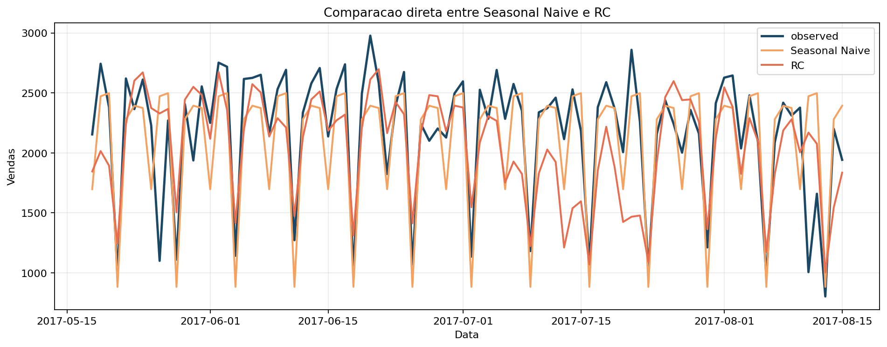

# Primeiro pipeline reproduzível: previsão de demanda no Favorita com baselines e RC

## Resumo

Este artigo transforma a teoria dos dois primeiros capítulos em um pipeline reproduzível de previsão. O objetivo é ensinar o leitor a executar um baseline forte e um primeiro modelo de Reservoir Computing no mesmo recorte adotado no Favorita, medindo ambos com o mesmo protocolo temporal. Fazemos isso em modo passo-a-passo: carregamos a série, separamos treino e teste, executamos `Seasonal Naive`, executamos RC, comparamos previsões, interpretamos métricas e discutimos por que perder para um baseline não invalida um experimento didático. O resultado principal e honesto: no recorte inicial, `Seasonal Naive` supera o RC em todas as métricas, mas o RC funciona de ponta a ponta e abre as perguntas certas para os artigos seguintes.

## 1. O que o leitor vai aprender

Ao final deste artigo, você será capaz de:

1. executar um pipeline mínimo de previsão no Favorita;
2. usar `Seasonal Naive` como baseline sério, e não apenas ilustrativo;
3. rodar o RC clássico do projeto do inicio ao fim;
4. comparar previsões com as mesmas métricas e o mesmo split temporal;
5. interpretar um resultado inicial ruim como parte do processo científico.

## 2. O recorte experimental herdado

Continuamos usando exatamente o mesmo recorte estabelecido no artigo 1:

- `store_nbr = 1`
- `family = BEVERAGES`
- frequência diária
- últimos `90` dias como teste

Isso significa que a comparação deste artigo e justa por construcao. Ambos os modelos veem os mesmos dados e sao avaliados pelas mesmas métricas.

## 3. Passo 1: carregar a série e separar treino e teste

O pipeline começa com as funções de `code/common/favorita.py`.

```python
config = FavoritaSeriesConfig()
frame = load_store_family_series(store_nbr=config.store_nbr, family=config.family)
train, test = temporal_train_test_split(frame, test_days=config.test_days)
```

Em notação temporal, o experimento usa

$$
\mathcal{D}_{train} = \{(x_t, y_t)\}_{t=1}^{T-90},
\qquad
\mathcal{D}_{test} = \{(x_t, y_t)\}_{t=T-89}^T.
$$

Esse split e fundamental. Se ele mudar entre os modelos, a comparação deixa de ser confiavel.

## 4. Passo 2: executar o baseline `Seasonal Naive`

O baseline sazonal do projeto esta em `code/baselines/seasonal_naives/model.py` e implementa a regra

$$
\hat{y}_t = y_{t-7},
$$

usando sazonalidade semanal.

A implementação é curta exatamente porque sua função pedagógica e clara:

```python
pattern = train["y"].to_numpy()[-season_length:]
repeats = int(np.ceil(horizon / season_length))
forecast = np.tile(pattern, repeats)[:horizon]
```

Para executar:

```bash
python code/baselines/seasonal_naives/run.py
pytest code/baselines/seasonal_naives/test_model.py
```

Um bom artigo de séries temporais não pula esta etapa. Se um modelo mais sofisticado não supera esse baseline, isso precisa aparecer no texto.

## 5. Passo 3: executar o primeiro RC

O RC clássico do projeto esta em `code/rc/model.py` e usa a configuração default:

- `n_reservoir = 80`
- `spectral_radius = 0.6`
- `leak_rate = 0.15`
- `washout = 14`

A dinâmica do reservatório é

$$
x_t = (1 - \alpha) x_{t-1} + \alpha \tanh(W_{res} x_{t-1} + W_{in} u_t + b),
$$

e o readout resolve uma regressão Ridge sobre

$$
\phi_t = [1; u_t; x_t].
$$

Para executar:

```bash
python code/rc/run.py
pytest code/rc/test_model.py
```

## 6. Passo 4: medir com o mesmo protocolo

As quatro métricas usadas na comparação sao:

$$
\mathrm{MAE},\quad \mathrm{RMSE},\quad \mathrm{WAPE},\quad \mathrm{sMAPE}.
$$

O ponto metodológico aqui é simples, mas decisivo: os modelos precisam ser comparados no mesmo horizonte, com as mesmas observações de teste e as mesmas regras de previsão recursiva.

## 7. Resultados iniciais

Os resultados reais obtidos no projeto foram os seguintes.

| Modelo | MAE | RMSE | WAPE | sMAPE |
| --- | --- | --- | --- | --- |
| Seasonal Naive | 259.067 | 352.280 | 0.1196 | 0.1361 |
| RC | 324.294 | 423.417 | 0.1498 | 0.1653 |

O `Seasonal Naive` supera o RC em todas as métricas. Em particular:

- o `MAE` do RC ficou 25.2% acima do baseline sazonal;
- o `RMSE` do RC ficou 20.2% acima do baseline sazonal.



A sobreposicao das previsões ajuda a ler o resultado com mais cuidado do que a tabela numerica isolada:

- o baseline acompanha melhor o padrão semanal;
- o RC funciona, mas ainda oscila mais em torno da série observada;
- o erro do RC não vem de um colapso do pipeline, e sim de representação insuficiente para este primeiro ajuste.

## 8. O que este experimento ensina

O experimento é didaticamente valioso por quatro motivos.

### 8.1 Baseline forte não é detalhe

Em séries temporais, um baseline sazonal simples pode ser surpreendentemente competitivo. Isso vale especialmente quando o sinal semanal e forte, como no caso de bebidas no recorte adotado no Favorita.

### 8.2 RC não deve ser tratado como magia

O RC funciona de ponta a ponta: carrega dados, constroi representação, treina readout e produz previsões. Mas funcionar não é o mesmo que vencer. O artigo faz questão de manter essa distinção.

### 8.3 Reprodutibilidade e uma conquista em si

Este pipeline deixa um trilho completo:

- código de carregamento;
- execucao do baseline;
- execucao do RC;
- testes;
- métricas salvas;
- imagens comparativas.

Essa cadeia e o que permite que os artigos seguintes falem de tuning, avaliação justa e QRC sem perder a base experimental.

### 8.4 Derrota inicial organiza as próximas perguntas

Como o RC perdeu para o baseline, os artigos seguintes precisam responder:

- o tamanho do reservatório esta adequado?
- a memória do modelo esta curta ou longa demais?
- o raio espectral esta instável?
- o leak rate esta ajudando ou atrapalhando?

Em um bom percurso didático, resultados fracos produzem perguntas fortes.

## 9. Como este artigo se conecta ao benchmark maior

O experimento deste artigo não encerra a comparação. Ele apenas estabelece o primeiro patamar:

- `Seasonal Naive` será mantido como referencia;
- RC será refinado e estudado com mais detalhe;
- novos competidores entrarao depois: `ETS`, `Prophet`, `XGBoost`, `LSTM` e `QRC`.

Essa progressao e importante porque impede um salto artificial do "primeiro RC" diretamente para o "QRC final".

## 10. Conclusão

O primeiro pipeline reproduzível da série esta fechado. O baseline sazonal venceu, o RC funcionou sem vencer e o leitor já tem um experimento concreto para estudar, modificar e rerodar. Isso é exatamente o que um artigo didático deveria entregar neste ponto: menos promessas vagas e mais reprodução concreta.

O próximo artigo vai usar essa base para explicar por que RC pode melhorar ou piorar tanto quando seus hiperparâmetros mudam.

## Entregaveis associados no repositorio

- baseline sazonal: `code/baselines/seasonal_naives/`
- RC clássico: `code/rc/`
- comparação numerica e visual deste artigo: `computational_results_20260402_222902/`
- figuras principais: `baseline_vs_rc_overlay.png`, `seasonal_naive_forecast_plot.png`, `rc_forecast_plot.png`

## Referencias

- Hyndman, R. J.; Athanasopoulos, G. Forecasting: Principles and Practice.
- Jaeger, H. The "echo state" approach to analysing and training recurrent neural networks.
- Lukosevicius, M. A practical guide to applying echo state networks.
