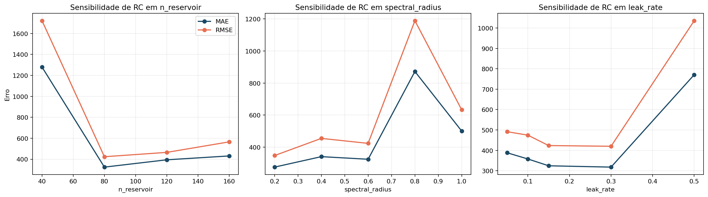

# Por que Reservoir Computing funciona: memória, não linearidade e capacidade de representação

## Resumo

Este artigo responde a pergunta que ficou aberta depois do primeiro pipeline: por que o desempenho do RC muda tanto quando ajustamos seus hiperparâmetros? Para responder, conectamos memória, não linearidade e capacidade de representação a resultados computacionais reais do projeto. Começamos por uma leitura teórica do reservatório, mostramos como o `leak_rate` controla a escala temporal efetiva, como o `spectral_radius` influencia estabilidade e mistura e como o tamanho do reservatório afeta a base de representação. Em seguida, analisamos os resultados de varreduras reais sobre `n_reservoir`, `spectral_radius` e `leak_rate`. O artigo não apenas explica RC em abstrato: ele mostra o que essas ideias produzem, ou destroem, no recorte adotado no Favorita.

## 1. O que o leitor vai aprender

Ao final deste artigo, você será capaz de:

1. explicar memória e não linearidade no RC em termos matemáticos;
2. entender por que `spectral_radius` e `leak_rate` mudam o comportamento do modelo;
3. interpretar tabelas de tuning do RC;
4. diferenciar capacidade de representação de mera quantidade de unidades;
5. decidir o que vale testar antes de partir para QRC.

## 2. Memória: o passado precisa continuar presente

Em RC, a memória não aparece como um vetor de lags explicitamente escrito. Ela aparece no proprio estado do reservatório. Se linearizarmos a dinâmica em torno de uma regiao pequena, obtemos aproximadamente

$$
x_t \approx A x_{t-1} + \alpha W_{in} u_t + \alpha b,
\qquad
A = (1 - \alpha) I + \alpha W_{res}.
$$

Desdobrando a recursao:

$$
x_t \approx \sum_{k=0}^\infty A^k (\alpha W_{in} u_{t-k} + \alpha b).
$$

Essa expressão mostra a intuição correta: o estado atual e uma superposicao ponderada do passado. A velocidade com que o passado "desaparece" depende da matriz efetiva $A$, logo depende de `spectral_radius` e `leak_rate`.

### 2.1 O papel do leak rate

O `leak_rate` regula quanto do estado novo substitui o estado antigo. Valores pequenos alongam a memória; valores grandes tornam a resposta mais reativa.

No projeto, o `leak_rate` default foi `0.15`, mas a varredura mostrou que `0.30` melhora levemente o resultado neste recorte.

| leak_rate | MAE | RMSE | WAPE | sMAPE |
| --- | --- | --- | --- | --- |
| 0.05 | 388.180 | 491.504 | 0.1793 | 0.1982 |
| 0.1 | 357.675 | 474.461 | 0.1652 | 0.1822 |
| 0.15 | 324.294 | 423.417 | 0.1498 | 0.1653 |
| 0.3 | 317.767 | 419.947 | 0.1467 | 0.1621 |
| 0.5 | 770.680 | 1035.544 | 0.3559 | 0.5702 |

Esse resultado ensina uma licao importante: uma memória mais longa não é automaticamente melhor. Se a série responde fortemente a promoção e sazonalidade semanal, uma resposta um pouco mais rápida pode ajudar.

### 2.2 O papel do washout

O `washout` separa o regime transiente inicial da dinâmica útil para treino:

$$
\Phi = [\phi_w, \phi_{w+1}, \dots, \phi_T]^\top.
$$

Sem `washout`, o readout pode aprender artefatos de inicialização em vez de aprender uma representação estabilizada da série.

## 3. Não linearidade: por que a série não cabe em uma regra única

O reservatório usa a não linearidade `tanh`:

$$
\widetilde{x}_t = \tanh(W_{res} x_{t-1} + W_{in} u_t + b).
$$

Essa não linearidade e o que permite ao modelo misturar efeitos de calendário, promoção e demanda prévia sem impor uma relação puramente aditiva ou puramente linear.

Em previsão de demanda, isso importa porque:

- a mesma promoção pode gerar efeitos diferentes em dias diferentes;
- o mesmo dia da semana pode ter resposta diferente dependendo do histórico imediato;
- a relação entre passado e presente não precisa ser monotona nem linear.

## 4. Capacidade de representação: tamanho importa, mas não sozinho

Um erro comum de iniciantes e supor que "mais unidades" sempre significa "mais desempenho". A varredura de `n_reservoir` no projeto mostra o contrario.

| n_reservoir | MAE | RMSE | WAPE | sMAPE |
| --- | --- | --- | --- | --- |
| 40 | 1278.623 | 1721.270 | 0.5904 | 0.4393 |
| 80 | 324.294 | 423.417 | 0.1498 | 0.1653 |
| 120 | 394.030 | 464.884 | 0.1820 | 0.2026 |
| 160 | 430.945 | 565.166 | 0.1990 | 0.2359 |

A configuração `n_reservoir = 80` foi a melhor entre as testadas. Quando o reservatório ficou pequeno demais (`40`), o erro explodiu. Mas aumentar para `120` e `160` também piorou.

Esse comportamento sugere que capacidade útil e compatibilidade com o problema importam mais do que simplesmente aumentar a dimensionalidade.

## 5. Estabilidade e mistura: o papel do spectral radius

O `spectral_radius` reescala a matriz recorrente para controlar o quanto a dinâmica interna amplifica ou dissipa o estado.

| spectral_radius | MAE | RMSE | WAPE | sMAPE |
| --- | --- | --- | --- | --- |
| 0.2 | 275.280 | 347.305 | 0.1271 | 0.1420 |
| 0.4 | 340.569 | 454.497 | 0.1573 | 0.1764 |
| 0.6 | 324.294 | 423.417 | 0.1498 | 0.1653 |
| 0.8 | 871.792 | 1188.448 | 0.4026 | 0.6992 |
| 1.0 | 500.267 | 632.914 | 0.2310 | 0.2519 |

A varredura mostra três regimes didaticamente importantes:

1. `0.2` produziu o melhor conjunto de métricas entre os valores testados;
2. `0.6` ficou em uma faixa intermediária e foi o default do primeiro pipeline;
3. `0.8` e `1.0` degradaram muito a estabilidade, com explosao de erro.

Em outras palavras, este recorte prefere um reservatório mais contido do que o default inicial sugeria.

## 6. Como ler os hiperparâmetros do RC no código

O ponto de entrada do tuning esta em `RCConfig`:

```python
@dataclass(frozen=True)
class RCConfig:
    n_reservoir: int = 80
    spectral_radius: float = 0.6
    leak_rate: float = 0.15
    input_scale: float = 0.8
    bias_scale: float = 0.1
    washout: int = 14
    ridge_alpha: float = 1e-3
    seed: int = 7
```

Um modo pratico de estudar o modelo e variar apenas um hiperparâmetro por vez, mantendo os demais fixos. Foi exatamente isso que os artefatos deste artigo fizeram.

## 7. O que o resultado atual do RC sugere



O resumo visual permite uma leitura didática direta:

- o modelo e sensivel ao `spectral_radius`;
- o `leak_rate` possui um ponto intermediário útil;
- o tamanho do reservatório tem um regime otimo local, e não monotonia.

Isso confirma uma licao central para a série: o RC não deve ser avaliado apenas por uma configuração arbitraria. Seu desempenho depende de como ajustamos memória, mistura e capacidade.

## 8. O que RC faz bem e o que ainda não faz bem aqui

### 8.1 O que RC faz bem

- constroi uma representação temporal dinâmica de baixo custo de treinamento;
- absorve sinais de promoção e calendário sem uma engenharia tabular extensa;
- oferece uma ponte conceitual excelente para o QRC.

### 8.2 O que RC ainda não faz bem aqui

- ainda não supera os melhores modelos clássicos neste recorte;
- ainda depende de tuning cuidadoso para evitar instabilidade ou sub-representação;
- ainda não incorpora a riqueza completa do dataset Favorita.

## 9. Passo-a-passo para reproduzir o estudo de sensibilidade

Um leitor que queira repetir este artigo pode seguir esta sequência:

1. executar `python code/rc/run.py` para fixar a configuração base;
2. alterar `RCConfig` em `code/rc/model.py` ou criar instancias novas em um script de experimento;
3. rerodar a previsão para cada combinacao;
4. comparar `MAE`, `RMSE`, `WAPE` e `sMAPE`;
5. guardar o resultado em CSV e imagem, como foi feito em `computational_results_20260402_222902/`.

Esse processo prepara o leitor para a fase seguinte da série, em que a comparação deixa de ser apenas "baseline versus RC" e vira um benchmark mais amplo.

## 10. Conclusão

Este artigo mostrou que o RC funciona porque oferece memória distribuída e não linearidade controlada, mas que essa vantagem depende de como configuramos o sistema dinamico. O proprio comportamento das varreduras do projeto ensina essa licao melhor do que qualquer definicao abstrata: parametros inadequados destroem o desempenho, enquanto escolhas razoaveis tornam o reservatório competitivo o suficiente para merecer comparação séria.

## Entregaveis associados no repositorio

- implementação do RC: `code/rc/model.py`
- artefatos de sensibilidade: `computational_results_20260402_222902/`
- arquivos principais: `rc_sweep_n_reservoir.csv`, `rc_sweep_spectral_radius.csv`, `rc_sweep_leak_rate.csv`, `rc_sensitivity_summary.png`

## Referencias

- Jaeger, H. The "echo state" approach to analysing and training recurrent neural networks.
- Lukosevicius, M. A practical guide to applying echo state networks.
- Verstraeten, D. et al. Memory versus non-linearity in reservoirs.
