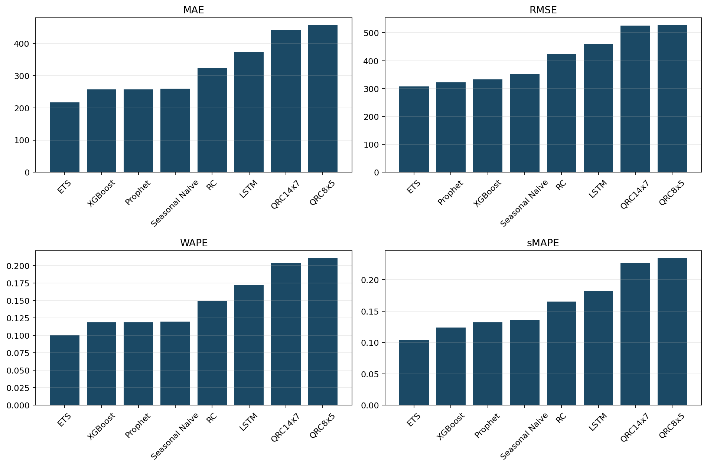
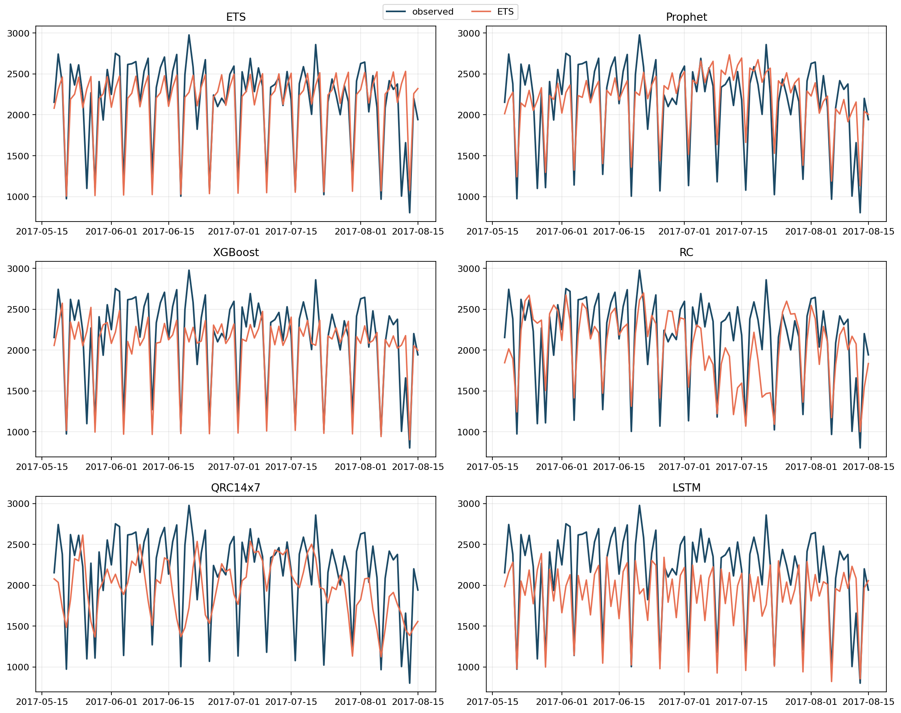

# Avaliação justa em previsão de demanda: baselines, IA clássica e Reservoir Computing

## Resumo

Este artigo organiza o benchmark central da série. O objetivo não é apenas mostrar uma tabela final, mas ensinar como comparar modelos de séries temporais de forma justa quando o interesse e chegar até RC e QRC sem perder contato com técnicas clássicas fortes. Por isso, o texto formaliza o protocolo experimental, resume as implementações já construídas no projeto, apresenta as equações mínimas das famílias avaliadas e discute o benchmark consolidado real no recorte adotado no Favorita. O resultado mais importante e metodológico: `ETS`, `XGBoost` e `Prophet` formam uma referencia forte que impede avaliar RC e QRC contra baselines fracos.

## 1. O que o leitor vai aprender

Ao final deste artigo, você será capaz de:

1. comparar modelos temporais com um protocolo realmente comum;
2. entender o papel de cada família de modelo no benchmark;
3. ler uma tabela comparativa sem cair em conclusoes apressadas;
4. reproduzir o benchmark com os scripts do projeto;
5. usar os resultados clássicos como referencia seria para RC e QRC.

## 2. Por que avaliação em séries temporais e delicada

Em séries temporais, avaliação injusta aparece facilmente:

- quando um modelo usa um split temporal diferente;
- quando features usam informação do futuro;
- quando um modelo recebe regressoras exógenas e outro não;
- quando os horizontes de previsão não coincidem;
- quando as métricas destacadas mudam de um experimento para outro.

Para evitar isso, este projeto fixa o seguinte principio:

$$
\text{mesmo recorte} + \text{mesmo split} + \text{mesmas métricas} = \text{comparação honesta}.
$$

## 3. Protocolo experimental da série

### 3.1 Recorte comum

Todos os modelos usam:

- `store_nbr = 1`
- `family = BEVERAGES`
- frequência diária
- últimos `90` dias como teste

### 3.2 Regra de split

Formalmente:

$$
\mathcal{D}_{train} = \{(x_t, y_t)\}_{t=1}^{T-90},
\qquad
\mathcal{D}_{test} = \{(x_t, y_t)\}_{t=T-89}^T.
$$

### 3.3 Modelos avaliados

```{=latex}
\begin{table}[htbp]
\centering
\small
\begin{tabularx}{\linewidth}{@{}lYY@{}}
\toprule
Modelo & Implementacao & Ideia central \\
\midrule
Seasonal Naive & \path{code/baselines/seasonal_naives/} & repete a ultima semana observada \\
ETS & \path{code/baselines/ets/} & modelo de nivel, tendencia e sazonalidade aditiva \\
Prophet & \path{code/baselines/prophet/} & decomposicao de tendencia, sazonalidade e regressor exogeno \\
XGBoost & \path{code/classical/xgboost/} & aprendizado tabular sobre lags e medias moveis \\
LSTM & \path{code/classical/lstm/} & rede recorrente treinada por gradiente \\
RC & \path{code/rc/} & reservatorio fixo e readout linear \\
QRC & \path{code/qrc/} & reservatorio quantico implementado com Qiskit \\
\bottomrule
\end{tabularx}
\end{table}
```

### 3.4 Métricas avaliadas

O benchmark usa:

$$
\mathrm{MAE},\ \mathrm{RMSE},\ \mathrm{WAPE},\ \mathrm{sMAPE}.
$$

As implementações dessas métricas estao em `code/common/metrics.py`.

## 4. As famílias de modelo em uma pagina

Para manter a comparação didática, vale resumir a lógica de cada família.

### 4.1 Seasonal Naive

$$
\hat{y}_t = y_{t-7}.
$$

Serve como baseline sazonal mínimo.

### 4.2 ETS

O ETS aditivo pode ser resumido por

$$
\ell_t = \alpha (y_t - s_{t-m}) + (1 - \alpha)(\ell_{t-1} + b_{t-1}),
$$
$$
b_t = \beta (\ell_t - \ell_{t-1}) + (1 - \beta) b_{t-1},
$$
$$
s_t = \gamma (y_t - \ell_t) + (1 - \gamma) s_{t-m}.
$$

### 4.3 Prophet

O Prophet modela a série como

$$
y(t) = g(t) + s(t) + h(t) + \beta x_t + \epsilon_t,
$$

em que `onpromotion` entra como regressor exógeno no projeto.

### 4.4 XGBoost

O modelo tabular usa lags, médias móveis e calendário para aprender

$$
\hat{y}_t = \sum_{m=1}^M f_m(z_t),
$$

com $z_t$ contendo `lag_1`, `lag_7`, `lag_14`, `lag_28`, médias móveis e calendarios.

### 4.5 LSTM

A LSTM usa portas para atualizar memória:

$$
i_t = \sigma(W_i [h_{t-1}, x_t] + b_i), \quad
f_t = \sigma(W_f [h_{t-1}, x_t] + b_f),
$$
$$
c_t = f_t \odot c_{t-1} + i_t \odot \tilde{c}_t.
$$

### 4.6 RC

$$
x_t = (1 - \alpha) x_{t-1} + \alpha \tanh(W_{res} x_{t-1} + W_{in} u_t + b).
$$

### 4.7 QRC

O QRC será detalhado nos artigos 6 e 7, mas aqui ele entra como

$$
z_t^{(j)} = \langle \psi_t | O_j | \psi_t \rangle,
\qquad
\hat{y}_t = W_{out} [1; u_t; z_t].
$$

## 5. Benchmark comparativo atual

A tabela abaixo resume os resultados reais obtidos no projeto.

| Modelo | Família | MAE | RMSE | WAPE | sMAPE |
| --- | --- | --- | --- | --- | --- |
| ETS | baseline estatístico | 216.303 | 307.638 | 0.0999 | 0.1042 |
| XGBoost | ML clássico | 256.666 | 332.828 | 0.1185 | 0.1237 |
| Prophet | baseline estatístico | 257.584 | 321.818 | 0.1189 | 0.1319 |
| Seasonal Naive | baseline estatístico | 259.067 | 352.280 | 0.1196 | 0.1361 |
| RC | reservoir computing clássico | 324.294 | 423.417 | 0.1498 | 0.1653 |
| LSTM | DL clássico | 371.827 | 461.342 | 0.1717 | 0.1822 |
| QRC14x7 | reservoir computing quântico | 441.286 | 525.325 | 0.2038 | 0.2269 |
| QRC8x5 | reservoir computing quântico | 455.833 | 526.949 | 0.2105 | 0.2342 |

Uma leitura ordenada por rank médio reforca a comparação.

| Modelo | Rank médio | MAE | RMSE | WAPE | sMAPE |
| --- | --- | --- | --- | --- | --- |
| ETS | 1.00 | 216.303 | 307.638 | 0.0999 | 0.1042 |
| XGBoost | 2.25 | 256.666 | 332.828 | 0.1185 | 0.1237 |
| Prophet | 2.75 | 257.584 | 321.818 | 0.1189 | 0.1319 |
| Seasonal Naive | 4.00 | 259.067 | 352.280 | 0.1196 | 0.1361 |
| RC | 5.00 | 324.294 | 423.417 | 0.1498 | 0.1653 |
| LSTM | 6.00 | 371.827 | 461.342 | 0.1717 | 0.1822 |
| QRC14x7 | 7.00 | 441.286 | 525.325 | 0.2038 | 0.2269 |
| QRC8x5 | 8.00 | 455.833 | 526.949 | 0.2105 | 0.2342 |





## 6. Leitura dos resultados

### 6.1 ETS na lideranca

O `ETS` foi o melhor modelo no recorte em todas as métricas principais. Isso é importante porque mostra que um baseline estatístico bem implementado continua sendo uma referencia difícil de bater.

### 6.2 XGBoost e Prophet como faixa intermediária forte

`XGBoost` e `Prophet` formam uma segunda faixa de desempenho. Ambos ficaram muito próximos do `Seasonal Naive` em algumas métricas, mas entregaram um pacote mais robusto no conjunto do benchmark.

### 6.3 O que o RC entrega

O `RC` superou a `LSTM`, o que é pedagogicamente interessante. Em um setup pequeno e pouco ajustado, uma rede recorrente treinada por gradiente não vence automaticamente um reservatório fixo.

### 6.4 O que o QRC entrega

O `QRC` funcionou de ponta a ponta e foi comparado no mesmo recorte de dados. No entanto, ficou abaixo das técnicas clássicas neste benchmark. Isso não invalida o estudo; ao contrario, torna a comparação mais honesta.

## 7. O que significa uma comparação justa

Este benchmark só é didaticamente útil porque respeita três regras:

1. todos os modelos usam os mesmos dados;
2. todos produzem previsão para os mesmos `90` dias;
3. todos sao julgados pelas mesmas métricas.

Isso evita a narrativa enganosa de que um modelo "venceu" porque recebeu mais contexto ou uma tarefa mais fácil.

## 8. Passo-a-passo para reproduzir o benchmark

A reprodução pode ser feita em lotes, executando um script por família:

```bash
python code/baselines/seasonal_naives/run.py
python code/baselines/ets/run.py
python code/baselines/prophet/run.py
python code/classical/xgboost/run.py
python code/classical/lstm/run.py
python code/rc/run.py
python code/qrc/run.py
```

Os testes associados seguem a mesma organização:

```bash
pytest code/baselines/seasonal_naives/test_model.py
pytest code/baselines/ets/test_model.py
pytest code/baselines/prophet/test_model.py
pytest code/classical/xgboost/test_model.py
pytest code/classical/lstm/test_model.py
pytest code/rc/test_model.py
pytest code/qrc/test_model.py
pytest code/qrc/test_objective.py
```

## 9. Checklist de boas praticas

O artigo deixa um checklist mínimo para os próximos experimentos:

- manter o split temporal fixo;
- registrar métricas em arquivo;
- salvar previsões e figuras;
- documentar hiperparâmetros;
- não comparar RC e QRC apenas com baselines fracos.

## 10. Regras herdadas para a fase QRC

Quando chegarmos ao QRC, duas regras deste benchmark continuam valendo:

1. o QRC deve ser comparado com as técnicas clássicas já implementadas;
2. o mesmo recorte de dados deve ser mantido, mesmo que o reservatório quântico simplifique sua representação interna.

Isso é o que transforma o estudo final em um artigo de ensino serio, e não em uma demonstracao isolada.

## 11. Conclusão

O benchmark consolidado da série esta agora estabelecido. Ele mostra que a competição relevante para RC e QRC não é contra referencias artificiais, mas contra modelos clássicos fortes e bem executados. Isso torna a rota até QRC intelectualmente mais exigente, mas também muito mais valiosa.

## Entregaveis associados no repositorio

- benchmark consolidado: `code/RESULTS.md`
- implementações de baseline: `code/baselines/`
- implementações clássicas: `code/classical/`
- implementação de RC: `code/rc/`
- implementação de QRC: `code/qrc/`
- artefatos comparativos deste artigo: pasta `computational_results_*/`

## Referencias

- Hyndman, R. J.; Athanasopoulos, G. Forecasting: Principles and Practice.
- Taylor, S. J.; Letham, B. Forecasting at Scale.
- Chen, T.; Guestrin, C. XGBoost: A scalable tree boosting system.
- Hochreiter, S.; Schmidhuber, J. Long short-term memory.
- Jaeger, H. The "echo state" approach to analysing and training recurrent neural networks.
