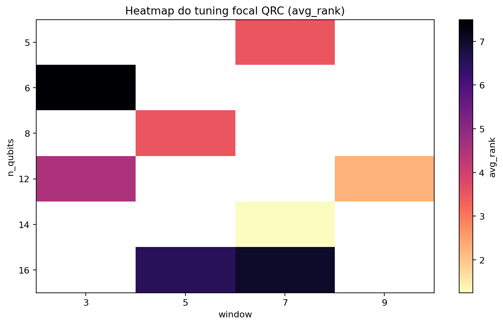

# De Reservoir Computing clássico a Quantum Reservoir Computing: a ponte conceitual

## Resumo

Este artigo constroi a ponte entre o RC clássico estudado até aqui e o QRC usado no estudo final. O objetivo é mostrar que QRC não nasce como um tema separado do restante da obra, mas como uma extensão natural da ideia de reservatório: manter a separacao entre dinâmica rica e readout simples, trocando o meio clássico por um meio quântico. O texto apresenta o paralelo formal entre RC e QRC, mapeia essa ponte para a implementação em Qiskit, discute a estrategia de tuning usada no projeto e introduz a função objetivo que equilibra desempenho e complexidade (`qubits`, `window`). Ao final, o leitor sabe por que duas configurações candidatas emergiram do tuning: `14x7` como melhor ponto multi-métrica e `8x5` como melhor compromisso segundo a função objetivo escalar.

## 1. O que o leitor vai aprender

Ao final deste artigo, você será capaz de:

1. enxergar RC e QRC dentro do mesmo paradigma;
2. entender como entradas clássicas sao codificadas em circuitos quânticos;
3. ler a implementação do QRC em `code/qrc/model.py`;
4. interpretar o tuning de `n_qubits` e `window`;
5. justificar tecnicamente por que `14x7` e `8x5` foram preservados para o artigo final.

## 2. RC como paradigma geral

No RC clássico, a ideia e:

$$
u_t \longrightarrow x_t \longrightarrow \phi_t \longrightarrow \hat{y}_t.
$$

Em outras palavras:

- a entrada $u_t$ perturba um sistema dinamico;
- o sistema responde com um estado $x_t$;
- o readout linear aprende a ler esse estado.

O QRC preserva exatamente essa lógica. O que muda e o meio em que a dinâmica interna acontece.

## 3. O salto para o quântico

No projeto, o reservatório quântico usa circuitos de reuploading implementados com Qiskit. Para cada qubit $q$ e para cada passo de entrada, a codificacao usa angulos do tipo

$$
\theta^{(q,t)}_x = s \, w_{x,q}^\top u_t + b_q,
\qquad
\theta^{(q,t)}_y = s \, w_{y,q}^\top u_t,
$$

em que:

- $u_t \in \mathbb{R}^4$ é o vetor clássico reduzido;
- $s$ e `input_scale`;
- $w_{x,q}$ e $w_{y,q}$ sao pesos aleatórios por qubit.

O circuito elementar do projeto aplica:

1. `RX` e `RY` em cada qubit;
2. um anel de emaranhamento `CZ`;
3. rotações `RZ` apos cada acoplamento.

## 4. Paralelo direto entre RC e QRC

O paralelo conceitual entre os dois modelos pode ser escrito assim:

| RC clássico | QRC do projeto |
| --- | --- |
| estado vetorial $x_t$ | estado quântico $\lvert\psi_t\rangle$ |
| matriz recorrente $W_{res}$ | circuito com `RX`, `RY`, `CZ`, `RZ` |
| features $[1; u_t; x_t]$ | features $[1; u_t; z_t]$ |
| readout linear | readout linear |

No QRC, as features observadas sao expectativas de operadores:

$$
z_t^{(j)} = \langle \psi_t | O_j | \psi_t \rangle.
$$

No projeto, cada configuração com $n_{\text{qubits}} = q$ gera $3q$ observáveis:

- $q$ observáveis $Z$;
- $q$ observáveis $X$;
- $q$ observáveis $ZZ$ entre vizinhos.

Isso significa que:

- `8x5` usa $24$ observáveis e um vetor final com $1 + 4 + 24 = 29$ features;
- `14x7` usa $42$ observáveis e um vetor final com $1 + 4 + 42 = 47$ features.

## 5. Como o projeto implementa essa ponte em Qiskit

O passo central de codificacao esta em `_step_circuit()`:

```python
for q in range(self.config.n_qubits):
    angle_x = self.config.input_scale * float(self.rx_weights[q] @ input_vector) + self.bias[q]
    angle_y = self.config.input_scale * float(self.ry_weights[q] @ input_vector)
    circuit.rx(angle_x, q)
    circuit.ry(angle_y, q)
```

O emaranhamento em anel aparece logo em seguida:

```python
for q in range(self.config.n_qubits - 1):
    circuit.cz(q, q + 1)
    circuit.rz(self.entangling_angles[q], q + 1)
circuit.cz(self.config.n_qubits - 1, 0)
circuit.rz(self.entangling_angles[-1], 0)
```

E as features sao extraidas via `Statevector.expectation_value()`:

```python
state = Statevector.from_instruction(circuit)
features = [float(np.real(state.expectation_value(obs))) for obs in self.observables]
```

Essa implementação e importante pedagogicamente porque mostra que o QRC do projeto não é uma caixa preta: ele e um pipeline legivel, curto e comparavel ao RC clássico.

## 6. Tuning de qubits e window

O tuning focalizado do projeto produziu a seguinte faixa superior de configurações:

```{=latex}
\begin{table}[htbp]
\centering
\footnotesize
\setlength{\tabcolsep}{3pt}
\begin{tabularx}{\linewidth}{@{}llCCCCC@{}}
\toprule
Qubits & Window & \shortstack{MAE\\medio} & \shortstack{RMSE\\medio} & \shortstack{WAPE\\medio} & \shortstack{sMAPE\\medio} & \shortstack{Rank\\medio} \\
\midrule
14 & 7 & 436.819 & 522.161 & 0.2017 & 0.2265 & 1.25 \\
12 & 9 & 445.061 & 524.709 & 0.2055 & 0.2306 & 2.25 \\
5 & 7 & 445.920 & 530.752 & 0.2059 & 0.2313 & 3.50 \\
8 & 5 & 447.947 & 520.913 & 0.2068 & 0.2313 & 3.50 \\
12 & 3 & 447.168 & 540.572 & 0.2065 & 0.2319 & 4.50 \\
\bottomrule
\end{tabularx}
\end{table}
```



A tabela mostra uma licao decisiva: aumentar `n_qubits` e `window` não melhora automaticamente o desempenho. O melhor ponto robusto ficou em `14x7`, enquanto `16x5` e `16x7` pioraram o rank médio.

## 7. Uma função objetivo para escolher configurações comparaveis

O projeto não ficou preso a um único critério. Além do rank médio multi-métrica, foi proposta uma função objetivo escalar

$$
J(q, w) = G(q, w) \cdot C(q, w),
$$

com

$$
G(q, w) = \exp\left(\sum_k \omega_k \log\frac{m_k(q, w)}{r_k}\right),
$$

e

$$
C(q, w) = 1 + \lambda \, \frac{\mathrm{norm}(q) + \mathrm{norm}(w)}{2}.
$$

Aqui:

- $m_k(q, w)$ sao as métricas do QRC;
- $r_k$ sao as métricas da melhor referencia não-QRC;
- $\omega_k$ sao pesos por métrica;
- $\lambda = 0.05$ penaliza complexidade adicional.

Os pesos usados foram:

- `MAE = 0.3`
- `RMSE = 0.3`
- `WAPE = 0.2`
- `sMAPE = 0.2`

O resumo da selecao ficou assim:

| Critério | Melhor configuração | Valor |
| --- | --- | --- |
| Melhor rank médio multi-métrica | 14x7 | 1.25 |
| Melhor função objetivo escalar | 8x5 | 2.0030 |

O critério multi-métrica favorece `14x7`. A função objetivo penalizada favorece `8x5`.

## 8. O que se ganha e o que se perde na ponte para QRC

### 8.1 O que se ganha

- uma nova classe de dinâmica para representar séries temporais;
- uma formulação muito natural para discutir observáveis e mistura de estados;
- uma extensão conceitual elegante do paradigma de reservatório.

### 8.2 O que se perde

- simplicidade operacional em relação ao RC clássico;
- custo computacional, especialmente quando `qubits` e `window` crescem;
- interpretabilidade imediata do estado interno.

## 9. Por que o benchmark anterior precisa ser herdado

O QRC só faz sentido pedagógico neste projeto porque herda o benchmark do artigo 5. Sem esse benchmark, seria fácil tratar o QRC como curiosidade isolada. Com ele, o leitor entende exatamente contra o que o QRC precisa ser comparado:

- `ETS`
- `XGBoost`
- `Prophet`
- `Seasonal Naive`
- `RC`
- `LSTM`

Essa heranca metodológica e o que impede a fase quântica de perder contato com o problema de negócio.

## 10. Conclusão

A ponte entre RC clássico e QRC esta pronta. O leitor agora tem um mapa formal, implementacional e experimental do salto para o quântico. O artigo final vai aproveitar exatamente essa ponte para executar e interpretar o QRC no recorte adotado no Favorita, comparando `14x7`, `8x5` e os melhores modelos clássicos.

## Entregaveis associados no repositorio

- implementação do QRC: `code/qrc/model.py`
- função objetivo: `code/qrc/objective.py`
- documentacao da função objetivo: `code/qrc/OBJECTIVE.md`
- artefatos deste artigo: `computational_results_20260402_222902/`

## Referencias

- Fujii, K.; Nakajima, K. Harnessing disordered-ensemble quantum dynamics for machine learning.
- Ghosh, S. et al. Quantum reservoir processing.
- Qiskit documentation.
- Monzani, F.; Ricci, E.; Nigro, L.; Prati, E. QRC-Lab: An Educational Toolbox for Quantum Reservoir Computing. arXiv:2602.03522.
