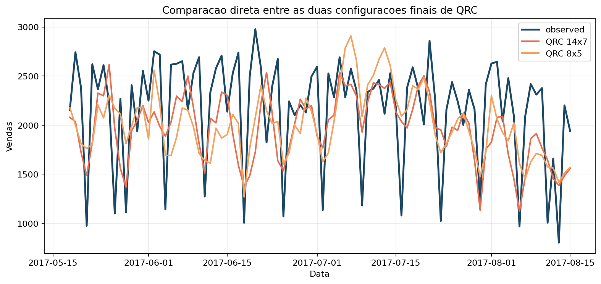
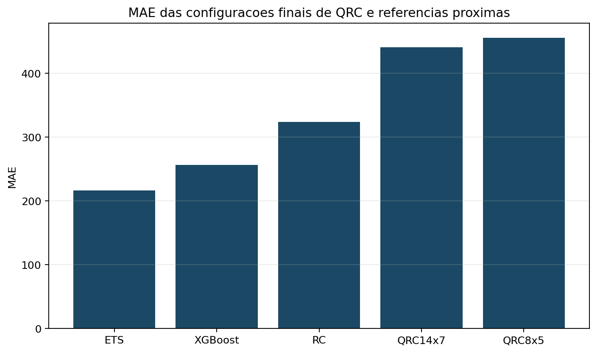

# Quantum Reservoir Computing para previsão de demanda: um estudo didático com o Favorita

## Resumo

Este artigo fecha a série com um estudo completo e didático de Quantum Reservoir Computing (QRC) aplicado ao recorte adotado no Favorita desde o primeiro capítulo. O texto unifica tudo o que foi construído anteriormente: problema de negócio, protocolo experimental, benchmark justo, intuição de reservatório e ponte conceitual para o quântico. Em seguida, apresenta o pipeline do QRC implementado com Qiskit, compara as configurações `14x7` e `8x5`, discute a função objetivo usada no tuning e posiciona os resultados do QRC ao lado de `ETS`, `XGBoost` e `RC`. O resultado final é instrutivo: o QRC funciona de ponta a ponta, `14x7` e a melhor configuração por desempenho puro, `8x5` e o melhor compromisso pela função objetivo, mas as técnicas clássicas seguem superiores neste recorte.

## 1. O que o leitor vai aprender

Ao final deste artigo, você será capaz de:

1. descrever o pipeline completo de QRC do projeto;
2. executar o modelo com Qiskit no recorte adotado no Favorita;
3. interpretar por que `14x7` e `8x5` coexistem como candidatos fortes;
4. comparar o QRC com RC e modelos clássicos no mesmo protocolo;
5. concluir o que a série inteira ensina sobre a rota até QRC.

## 2. O recorte experimental herdado da série

O estudo final não muda o problema para favorecer o QRC. Ele preserva:

- `store_nbr = 1`
- `family = BEVERAGES`
- frequência diária
- últimos `90` dias como teste

Isso garante continuidade didática e comparabilidade científica.

## 3. Pipeline de QRC usado no projeto

### 3.1 Entrada

O QRC usa um vetor de entrada clássico reduzido:

$$
u_t =
\begin{bmatrix}
\widetilde{y}_{t-1} &
\widetilde{p}_t &
\sin(2\pi \, \mathrm{dow}_t / 7) &
\cos(2\pi \, \mathrm{dow}_t / 7)
\end{bmatrix}^\top.
$$

Essa reducao aparece em `_quantum_input_vector()`, que seleciona os quatro primeiros componentes do vetor sequencial clássico.

### 3.2 Dinâmica quântica

Para cada passo da janela, o circuito aplica rotações `RX` e `RY` em todos os qubits e um anel de emaranhamento `CZ` + `RZ`. Se chamarmos o operador de um passo de $U(u_t)$, a representação da janela fica

$$
|\psi_t\rangle = U(u_t) U(u_{t-1}) \cdots U(u_{t-w+1}) |0 \cdots 0\rangle.
$$

### 3.3 Observáveis

As features quânticas sao expectativas:

$$
z_t^{(j)} = \langle \psi_t | O_j | \psi_t \rangle.
$$

O projeto usa observáveis `Z`, `X` e `ZZ`, totalizando `3q` componentes para `q` qubits.

### 3.4 Readout

O readout final continua sendo simples:

$$
\hat{y}_t = W_{out} [1; u_t; z_t],
$$

com treinamento Ridge:

$$
W_{out}^* = \arg\min_{W_{out}} \|Y - \Phi W_{out}\|_2^2 + \lambda \|W_{out}\|_2^2.
$$

Em outras palavras, o QRC do projeto herda a filosofia central de RC: dinâmica rica, readout simples.

## 4. Implementação passo-a-passo

O leitor pode percorrer a implementação nesta ordem.

### 4.1 Passo 1: definir a configuração

```python
@dataclass(frozen=True)
class QRCConfig:
    n_qubits: int = 14
    window: int = 7
    input_scale: float = 1.2
    ridge_alpha: float = 1e-1
    seed: int = 7
```

### 4.2 Passo 2: construir o circuito por passo

O código central esta em `_step_circuit()` e usa `QuantumCircuit` do Qiskit.

### 4.3 Passo 3: acumular a janela quântica

`features_from_window()` compoe sucessivos passos do circuito antes de criar o `Statevector`.

### 4.4 Passo 4: medir observáveis

O método `_build_observables()` cria as listas de operadores `Z`, `X` e `ZZ`.

### 4.5 Passo 5: ajustar o readout e prever

`fit_qrc_readout()` treina o Ridge e `forecast_qrc()` faz previsão recursiva no bloco de teste.

Para executar:

```bash
python code/qrc/run.py
pytest code/qrc/test_model.py
pytest code/qrc/test_objective.py
```

## 5. Configuração experimental

O tuning anterior deixou duas configurações principais:

- melhor configuração por rank médio multi-métrica: `14x7`
- melhor configuração pela função objetivo escalar: `8x5`

O artigo final preserva as duas porque elas respondem a perguntas diferentes:

- "qual performa melhor nas métricas?" -> `14x7`
- "qual equilibra melhor desempenho e complexidade?" -> `8x5`

## 6. Resultados do QRC

A comparação direta entre as duas configurações ficou assim:

| Modelo | MAE | RMSE | WAPE | sMAPE |
| --- | --- | --- | --- | --- |
| QRC14x7 | 441.286 | 525.325 | 0.2038 | 0.2269 |
| QRC8x5 | 455.833 | 526.949 | 0.2105 | 0.2342 |





A leitura dos dois pontos é clara:

- `14x7` foi melhor que `8x5` nas quatro métricas no run direto;
- `8x5` permaneceu relevante porque sua função objetivo penalizada era melhor;
- o trade-off entre desempenho e complexidade foi real, não artificial.

## 7. Comparação com RC e técnicas clássicas

O QRC precisa ser lido ao lado do benchmark herdado, não isoladamente.

| Modelo | MAE | RMSE | WAPE | sMAPE |
| --- | --- | --- | --- | --- |
| ETS | 216.303 | 307.638 | 0.0999 | 0.1042 |
| XGBoost | 256.666 | 332.828 | 0.1185 | 0.1237 |
| RC | 324.294 | 423.417 | 0.1498 | 0.1653 |
| QRC14x7 | 441.286 | 525.325 | 0.2038 | 0.2269 |
| QRC8x5 | 455.833 | 526.949 | 0.2105 | 0.2342 |

O ponto central do estudo e este:

- `QRC14x7` ficou cerca de 36.1% acima do `RC` em `MAE`;
- `QRC14x7` ficou cerca de 104.0% acima do `ETS` em `MAE`;
- ainda assim, o pipeline quântico funcionou de ponta a ponta no mesmo recorte de negócio.

## 8. O que os resultados mostram e o que eles não mostram

### 8.1 O que mostram

- QRC pode ser implementado de modo didático e reprodutível com Qiskit;
- tuning de `qubits` e `window` importa muito;
- o melhor QRC do projeto foi `14x7`;
- comparações honestas sao possíveis no mesmo recorte adotado no Favorita.

### 8.2 O que não mostram

- que QRC seja superior a técnicas clássicas neste problema;
- que aumentar qubits sempre melhora desempenho;
- que o estudo atual esgote o espaco de arquiteturas quânticas possíveis.

## 9. A contribuição didática do estudo final

O estudo final não vale apenas pela tabela de métricas. Ele vale porque fecha uma trilha de ensino completa:

1. do problema de negócio;
2. aos baselines;
3. ao RC clássico;
4. ao tuning;
5. ao benchmark justo;
6. a ponte quântica;
7. ao QRC implementado e comparado.

Essa sequência e o que transforma o conjunto dos sete artigos em um material "101" real para QRC.

## 10. O que o leitor aprendeu do artigo 1 ao 7

Ao final da série, o leitor passou a saber:

- formular um problema real de previsão de demanda;
- construir um protocolo temporal correto;
- comparar baselines, IA clássica, RC e QRC;
- ler e modificar as implementações do projeto;
- interpretar resultados negativos ou medianos sem perder valor científico;
- entender QRC como extensão do paradigma de reservatório, e não como curiosidade isolada.

## 11. Conclusão

O QRC do projeto funciona, ensina, compara e fecha a série de forma honesta. O melhor resultado puro ficou em `14x7`; o melhor compromisso com penalizacao de complexidade ficou em `8x5`. Nenhum dos dois venceu os melhores modelos clássicos no recorte adotado no Favorita, mas ambos cumprem o papel mais importante desta obra: ensinar, de forma continua e reproduzível, como sair do zero e chegar a um estudo completo de Quantum Reservoir Computing aplicado a um problema real.

## Entregaveis associados no repositorio

- implementação do QRC: `code/qrc/`
- tuning e função objetivo: `code/qrc/objective.py`, `code/qrc/OBJECTIVE.md`
- benchmark consolidado: `code/RESULTS.md`
- artefatos deste artigo: `computational_results_20260402_222902/`

## Referencias

- Fujii, K.; Nakajima, K. Harnessing disordered-ensemble quantum dynamics for machine learning.
- Ghosh, S. et al. Quantum reservoir processing.
- Qiskit documentation.
- Jaeger, H. The "echo state" approach to analysing and training recurrent neural networks.
- Monzani, F.; Ricci, E.; Nigro, L.; Prati, E. QRC-Lab: An Educational Toolbox for Quantum Reservoir Computing. arXiv:2602.03522.
